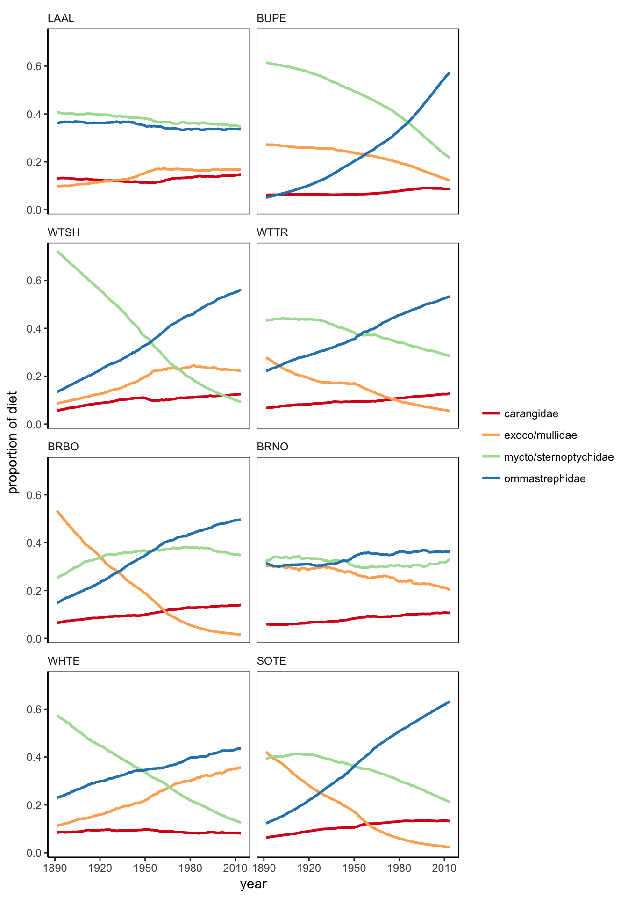

README
================
Tyler Gagne
6/8/2017

public repository for seabird CSIA-AA trophic position analysis

In this repository you will find script and markdown examples of analysis used to generate the figures in _Gagne, Hyrenbach, Hagemann, and Van Houtan, In Prep._

The file structure is as follows:

data <- contains CSV and .rData files used in construction of markdowns

markdowns <- contains annotated markdowns for individual figure development (this is probably where you want to go) rMarkdowns <- contains orginal RMarkdown scripts used to generate .md files

__Long form markdown out below__
see individual markdowns in markdown folder if interested in single section (mirror copy splits)

Build function to draw random AA samples from analytic's distribution and generate dataset.

``` r
N <- 1000

GetTP <- function(anID){
  b = 2.4167
  TEF = 5.6333
  ala.est<- rnorm(N, mean = as.numeric(subset(anID, value == "ave", select = "ala")) , sd = as.numeric(subset(anID, value == "sd", select = "ala")))
  glu.est<- rnorm(N, mean = as.numeric(subset(anID, value == "ave", select = "glue")) , sd = as.numeric(subset(anID, value == "sd", select = "glue")))
  ile.est<- rnorm(N, mean = as.numeric(subset(anID, value == "ave", select = "ile")) , sd = as.numeric(subset(anID, value == "sd", select = "ile")))
  leu.est<- rnorm(N, mean = as.numeric(subset(anID, value == "ave", select = "leu")) , sd = as.numeric(subset(anID, value == "sd", select = "leu")))
  pro.est<- rnorm(N, mean = as.numeric(subset(anID, value == "ave", select = "pro")) , sd = as.numeric(subset(anID, value == "sd", select = "pro")))
  val.est<- rnorm(N, mean = as.numeric(subset(anID, value == "ave", select = "val")) , sd = as.numeric(subset(anID, value == "sd", select = "val")))
  phe.est<- rnorm(N, mean = as.numeric(subset(anID, value == "ave", select = "phe")) , sd = as.numeric(subset(anID, value == "sd", select = "phe")))
  TPforID <- (((((ala.est + glu.est + ile.est + leu.est + pro.est + val.est)/6)) - phe.est - b)/TEF ) + 1 
  return(TPforID)}
```

Run for loop to generate longitudinal plots of trophic position accorss time.

``` r
sppx<-c("LAAL","BUPE","WTSH","WTTR","BRBO","BRNO","WHTE","SOTE","TP")         # adjust order taxonomically 

S <- 1000

par(mfrow=c(5,2), mai = c(.4, 0.4, 0.4, 0.4))                                 # build plot frame
for(x in 1:length(sppx)){
  if(x < 9) {
    species_data <- subset(total, spp == sppx[x])
  } else{
    species_data <- total
  }
   tp_predict = as.data.frame(matrix(ncol=1000,nrow=126))
  
  for (i in 1:S){
    new_df <- ddply(species_data,.(year),function(x) x[sample(nrow(x),1),])   # sample value from each available year
    tp_est <- loess(tp ~ year, new_df,span = 1)                               # fit loess model through the series
    tp_predict[i] <- as.data.frame(predict(tp_est,data.frame(year = seq(1890, 2015,1)))) # predict for all years
  }
  tp_predict$year <- seq(1890, 2015, by = 1)
  test_data_long <- melt(tp_predict, id="year")
  
  #gather quantiles from data
  sum_data<- do.call(data.frame,aggregate(value ~ year, data = test_data_long, function(x) c(quantile(x,.975),quantile(x,.025),median(x) )))
  
  #build plots
  plot(sum_data$year,sum_data$value.V3, type = "l",col="blue",main = sppx[x], ylab = '',xlab = '',ylim=c(3.4,4.4))
  lines(sum_data$year,sum_data$value.97.5.,col="light blue")
  lines(sum_data$year,sum_data$value.2.5.,col="light blue")
  
  b<-1979
  
  #overlay Harrison et al. 1983 calculated trophic levels 
  if(x < 9) {
    z<-subset(preyMTL_data,spp = species_data$spp[x])
    y<-z$ad_mean_tl[x]
    points(b,y,pch = 20)
    sd<-z$SE_mean_TL[x]
    arrows(b,y-sd,b,y+sd, code=3, length=0.02, angle = 90)
    abline(h=subset(sum_data, year == 1891, select = value.V3 ),lty = "dotted" )
  }else{
    b<- 1979
    y<-mean(preyMTL_data$ad_mean_tl)
    points(b,y, pch = 20)
    sd<-mean(z$SE_mean_TL)
    arrows(b,y-sd,b,y+sd, code=3, length=0.02, angle = 90)
    abline(h=subset(sum_data, year == 1891, select = value.V3 ),lty = "dotted" )
  }
  
  labels_axes <- c("")
  y_ticks = c(3.4,3.5,3.6,3.7,3.8,3.9,4.0,4.1,4.2,4.3,4.4)
  x_ticks = c(1900,1910,1920,1930,1940,1950,1960,1970,1980,1990,2000,2010)
  axis(side = 1, at = x_ticks, labels = FALSE, outer = FALSE)
  axis(side = 2, at = y_ticks, labels = TRUE, outer = FALSE)
  
  title(tp_est $pars $span, outer = TRUE, cex = 1.5, line = -2)
}  
```


**Bayesian MCMC hierarchical mixing model to estimate proportion of prey contributing to diet at expected trophic position **

``` r
sppx <- c("SOTE", "WTSH", "BRBO", "BRNO", "LAAL", "BUPE", "WTTR", "WHTE")
# sppx<- 'SOTE'
data_box = NULL

for (x in 1:length(sppx)) {
    mix <- read.csv("mixture_data_may22.csv")
    str(mix)
    mix <- subset(mix, spp == sppx[x])
    write.csv(mix, file = "mixture_data_spp.csv")
    
    # mix data = i.e. consumer
    mix <- load_mix_data(filename = "mixture_data_spp.csv", iso_names = "TL", 
        factors = "spp", fac_random = TRUE, fac_nested = NULL, cont_effects = "year")
    # source data #new omma and caran TL
    source <- load_source_data(filename = "source_data_4grp_may22.csv", source_factors = NULL, 
        conc_dep = FALSE, data_type = "means", mix)
    # discrimination data
    discr <- load_discr_data(filename = "discrimination_data_4grp.csv", mix)
    # one dimensional isospace plot plot_data(filename='isospace_plot',
    # plot_save_pdf=FALSE, plot_save_png=FALSE, mix,source,discr) uninformative
    # prior = alpha.prior = 1 construct informative prior from
    # stomach_proportional_plot_apr13.xlsx
    TP_prior <- c(0.508, 1.212, 1.175, 1.105)
    # plot_prior(alpha.prior = TP_prior, source, plot_save_pdf=FALSE,
    # plot_save_png=FALSE) write jags model
    model_filename <- "MixSIAR_model.txt"
    resid_err <- FALSE
    process_err <- TRUE
    write_JAGS_model(model_filename, resid_err, process_err, mix, source)
    # run model
    jags.1 <- run_model(run = "test", mix, source, discr, model_filename, alpha.prior = TP_prior, 
        resid_err, process_err)
    ########################## 
    R2jags::attach.jags(jags.1)
    n.sources <- source$n.sources
    source_names <- source$source_names
    
    fac.lab <- mix$FAC[[1]]$labels
    label <- mix$cont_effects
    cont <- mix$CE[[1]]  #either CE or CE_orig explore implications?
    ilr.cont <- get(paste("ilr.cont", 1, sep = ""))
    
    get_high <- function(x) {
        return(quantile(x, 0.95))
    }
    get_low <- function(x) {
        return(quantile(x, 0.05))
    }
    
    n.plot = 124  #200 was original consider changing to number of years? which I did
    chain.len = dim(p.global)[1]
    Cont1.plot <- seq(from = round(min(cont), 1), to = round(max(cont), 1), 
        length.out = n.plot)
    ilr.plot <- array(NA, dim = c(n.plot, n.sources - 1, chain.len))
    ilr.median <- array(NA, dim = c(n.plot, n.sources - 1))
    ilr.low <- array(NA, dim = c(n.plot, n.sources - 1))
    ilr.high <- array(NA, dim = c(n.plot, n.sources - 1))
    for (src in 1:n.sources - 1) {
        for (i in 1:n.plot) {
            ilr.plot[i, src, ] <- ilr.global[, src] + ilr.cont[, src] * Cont1.plot[i]  #+ ilr.fac1[,f1,src]
            ilr.low[i, src] <- get_low(ilr.plot[i, src, ])
            ilr.median[i, src] <- median(ilr.plot[i, src, ])  #changed from median to mean 
            ilr.high[i, src] <- get_high(ilr.plot[i, src, ])
        }
    }
    
    # Transform regression lines from ILR-space to p-space
    e <- matrix(rep(0, n.sources * (n.sources - 1)), nrow = n.sources, ncol = (n.sources - 
        1))
    for (i in 1:(n.sources - 1)) {
        e[, i] <- exp(c(rep(sqrt(1/(i * (i + 1))), i), -sqrt(i/(i + 1)), rep(0, 
            n.sources - i - 1)))
        e[, i] <- e[, i]/sum(e[, i])
    }
    cross.med <- array(data = NA, dim = c(n.plot, n.sources, n.sources - 1))  # dummy variable for inverse ILR calculation
    tmp.p.med <- array(data = NA, dim = c(n.plot, n.sources))  # dummy variable for inverse ILR calculation
    p.median <- array(data = NA, dim = c(n.plot, n.sources))
    cross.low <- array(data = NA, dim = c(n.plot, n.sources, n.sources - 1))  # dummy variable for inverse ILR calculation
    tmp.p.low <- array(data = NA, dim = c(n.plot, n.sources))  # dummy variable for inverse ILR calculation
    p.low <- array(data = NA, dim = c(n.plot, n.sources))
    cross.high <- array(data = NA, dim = c(n.plot, n.sources, n.sources - 1))  # dummy variable for inverse ILR calculation
    tmp.p.high <- array(data = NA, dim = c(n.plot, n.sources))  # dummy variable for inverse ILR calculation
    p.high <- array(data = NA, dim = c(n.plot, n.sources))
    for (i in 1:n.plot) {
        for (j in 1:(n.sources - 1)) {
            cross.med[i, , j] <- (e[, j]^ilr.median[i, j])/sum(e[, j]^ilr.median[i, 
                j])
            cross.low[i, , j] <- (e[, j]^ilr.low[i, j])/sum(e[, j]^ilr.low[i, 
                j])
            cross.high[i, , j] <- (e[, j]^ilr.high[i, j])/sum(e[, j]^ilr.high[i, 
                j])
        }
        for (src in 1:n.sources) {
            tmp.p.med[i, src] <- prod(cross.med[i, src, ])
            tmp.p.low[i, src] <- prod(cross.low[i, src, ])
            tmp.p.high[i, src] <- prod(cross.high[i, src, ])
        }
        for (src in 1:n.sources) {
            p.median[i, src] <- tmp.p.med[i, src]/sum(tmp.p.med[i, ])
            p.low[i, src] <- tmp.p.low[i, src]/sum(tmp.p.low[i, ])
            p.high[i, src] <- tmp.p.high[i, src]/sum(tmp.p.high[i, ])
        }
    }
    colnames(p.median) <- source_names
    
    Cont1.plot <- Cont1.plot * 35.93976 + mix$CE_center  # transform Cont1.plot (x-axis) back to the original scale
    df <- data.frame(reshape2::melt(p.median)[, 2:3], rep(Cont1.plot, n.sources), 
        reshape2::melt(p.low)[, 3], reshape2::melt(p.high)[, 3])
    colnames(df) <- c("source", "median", "x", "low", "high")
    
    # Plot of Diet vs. Cont effect Fill##
    
    df$spp <- ifelse(df$high < 100, sppx[x])
    
    data_box = rbind(data_box, df)
}
################### END MCMC LOOP###
```

``` r
data_box$spp <- as.factor(data_box$spp)
data_box$spp <- factor(data_box$spp, levels=c("LAAL", "BUPE", "WTSH", "WTTR", "BRBO","BRNO","WHTE","SOTE","TP"))

#data_box <- subset(data_box, spp == c("LAAL", "BUPE", "WTSH", "WTTR", "BRBO","BRNO","WHTE","SOTE"))

ggplot(data_box, aes(x=x))+geom_line(aes(y=median,color = source),size = 1)+scale_color_brewer(type = "seq",palette = 'Spectral' )+facet_wrap(~spp,ncol =2)+theme_classic()+ 
  theme(strip.background = element_blank(),
        panel.border = element_rect(colour = "black", fill=NA, size=.5),
        legend.title=element_blank(),
        strip.text=element_text(hjust=0))+
  xlab("year")+
  ylab("proportion of diet")
```




**Random Forest model development**

*Set working directory and read in dataset*

Read in reconstuctured Sea Around Us project data

``` r
famandspp<-read.csv("SAULandings_familyandspp.csv", header = T)
```

quick plot to take a look at it

``` r
a<-ggplot(famandspp,aes(x=year,y=sqrt(sumcatch)))+
  geom_line(aes(color=Taxon.Name))+theme_bw()
a
```


recast and from in to df with columns for catch taxa

``` r
df <- data.frame(cast(famandspp, year ~ Taxon.Name ))
```

    ## Using sumcatch as value column.  Use the value argument to cast to override this choice

*Bring in old dataset*

``` r
bigger_data<-read.csv("final_dataset_may10.csv", header = T)
###EDIT BUPE FORAGE DIST TO 350###
BUPE_new_forage_dist <- 350
bigger_data$forage_dist[bigger_data$spp == "BUPE"] <- BUPE_new_forage_dist
###NOTE: for lag variable incorporation, must be run post 1951 due to NPGO availability up to 1950
#subset out post 1950 data
```

*Subset out post-1950 and merge in SAU data*

``` r
full_data <- subset(bigger_data,year >= 1951)
#merge in SAU fisheries
test<-merge(full_data,df,by="year")
full_data <- test
str(full_data)
```

    ## 'data.frame':    77000 obs. of  79 variables:
    ##  $ year                     : int  1954 1954 1954 1954 1954 1954 1954 1954 1954 1954 ...
    ##  $ X.1                      : int  43864 51593 40439 36203 51978 42137 35607 31290 50541 52347 ...
    ##  $ spp                      : Factor w/ 8 levels "BRBO","BRNO",..: 3 3 3 3 3 3 3 3 3 3 ...
    ##  $ X                        : int  49845 39745 44242 44291 36979 51919 37253 44723 48544 32233 ...
    ##  $ aveENSO_SST_by_year      : num  26.5 26.5 26.5 26.5 26.5 ...
    ##  $ MEIave_by_year           : num  -0.534 -0.534 -0.534 -0.534 -0.534 ...
    ##  $ PDOave_by_year           : num  -0.328 -0.328 -0.328 -0.328 -0.328 ...
    ##  $ uc_id                    : Factor w/ 134 levels "KVH007","KVH008",..: 83 83 60 83 64 60 60 64 83 60 ...
    ##  $ accession_id             : Factor w/ 134 levels "1891_BRBO_773",..: 54 54 52 54 53 52 52 53 54 52 ...
    ##  $ value                    : Factor w/ 1 level "ave": 1 1 1 1 1 1 1 1 1 1 ...
    ##  $ ala                      : num  27.9 27.9 24.9 27.9 26.3 ...
    ##  $ asp                      : num  22 22 20.5 22 20 ...
    ##  $ glue                     : num  29.9 29.9 26.8 29.9 28.4 ...
    ##  $ gly                      : num  7.65 7.65 5.99 7.65 3.57 ...
    ##  $ ile                      : num  31.7 31.7 28.1 31.7 28.9 ...
    ##  $ leu                      : num  31.3 31.3 26.7 31.3 27.9 ...
    ##  $ phe                      : num  10.74 10.74 5.54 10.74 7.97 ...
    ##  $ pro                      : num  32.1 32.1 30.4 32.1 28.8 ...
    ##  $ val                      : num  33.2 33.2 29.9 33.2 30.7 ...
    ##  $ tp                       : num  4.06 4.03 4.58 4.02 4.27 ...
    ##  $ family                   : Factor w/ 5 levels "Diomedeidae",..: 3 3 3 3 3 3 3 3 3 3 ...
    ##  $ group                    : Factor w/ 7 levels "Albatross","Booby",..: 3 3 3 3 3 3 3 3 3 3 ...
    ##  $ common.name              : Factor w/ 8 levels "Brown Booby",..: 3 3 3 3 3 3 3 3 3 3 ...
    ##  $ species                  : Factor w/ 8 levels "Anous stolidus",..: 2 2 2 2 2 2 2 2 2 2 ...
    ##  $ guild                    : Factor w/ 4 levels "Plunge diving",..: 4 4 4 4 4 4 4 4 4 4 ...
    ##  $ mass_lo_g                : int  78 78 78 78 78 78 78 78 78 78 ...
    ##  $ mass_hi_g                : int  130 130 130 130 130 130 130 130 130 130 ...
    ##  $ length_cm                : num  27 27 27 27 27 27 27 27 27 27 ...
    ##  $ iucn_stat                : Factor w/ 2 levels "LC","NT": 1 1 1 1 1 1 1 1 1 1 ...
    ##  $ FAO_exocoetidae_catch    : int  17100 17100 17100 17100 17100 17100 17100 17100 17100 17100 ...
    ##  $ FAO_mullidae_catch       : int  5100 5100 5100 5100 5100 5100 5100 5100 5100 5100 ...
    ##  $ FAO_ommastrephidae_catch : int  440499 440499 440499 440499 440499 440499 440499 440499 440499 440499 ...
    ##  $ FAO_gempylidae_catch     : int  0 0 0 0 0 0 0 0 0 0 ...
    ##  $ FAO_sternoptychidae_catch: int  0 0 0 0 0 0 0 0 0 0 ...
    ##  $ FAO_gempylidae_catch.1   : int  0 0 0 0 0 0 0 0 0 0 ...
    ##  $ FAO_hemiramphidae_catch  : int  5900 5900 5900 5900 5900 5900 5900 5900 5900 5900 ...
    ##  $ FAO_carangidae_catch     : int  371383 371383 371383 371383 371383 371383 371383 371383 371383 371383 ...
    ##  $ FAO_syndontidae_catch    : int  28400 28400 28400 28400 28400 28400 28400 28400 28400 28400 ...
    ##  $ FAO_coryphaenidae_catch  : int  5800 5800 5800 5800 5800 5800 5800 5800 5800 5800 ...
    ##  $ NPGOyear_mean            : num  0.207 0.207 0.207 0.207 0.207 ...
    ##  $ NPGO_lowpass             : num  -0.038 -0.038 -0.038 -0.038 -0.038 ...
    ##  $ caran_pec_total          : int  9136 9136 9136 9136 9136 9136 9136 9136 9136 9136 ...
    ##  $ caran_pne_total          : int  0 0 0 0 0 0 0 0 0 0 ...
    ##  $ caran_pwc_total          : int  48400 48400 48400 48400 48400 48400 48400 48400 48400 48400 ...
    ##  $ exoco_pec_total          : int  0 0 0 0 0 0 0 0 0 0 ...
    ##  $ exoco_pnw_total          : int  11300 11300 11300 11300 11300 11300 11300 11300 11300 11300 ...
    ##  $ exoco_pwc_total          : int  5800 5800 5800 5800 5800 5800 5800 5800 5800 5800 ...
    ##  $ mull_pwc_total           : int  1700 1700 1700 1700 1700 1700 1700 1700 1700 1700 ...
    ##  $ mull_pec_total           : int  0 0 0 0 0 0 0 0 0 0 ...
    ##  $ mull_pnw_total           : int  3400 3400 3400 3400 3400 3400 3400 3400 3400 3400 ...
    ##  $ omma_pec_total           : int  3699 3699 3699 3699 3699 3699 3699 3699 3699 3699 ...
    ##  $ omma_pne_total           : int  0 0 0 0 0 0 0 0 0 0 ...
    ##  $ omma_pnw_total           : int  436800 436800 436800 436800 436800 436800 436800 436800 436800 436800 ...
    ##  $ omma_pwc_total           : int  0 0 0 0 0 0 0 0 0 0 ...
    ##  $ syno_pwc_total           : int  400 400 400 400 400 400 400 400 400 400 ...
    ##  $ syno_pnw_total           : int  28000 28000 28000 28000 28000 28000 28000 28000 28000 28000 ...
    ##  $ caran_total              : int  371383 371383 371383 371383 371383 371383 371383 371383 371383 371383 ...
    ##  $ exoco_total              : int  17100 17100 17100 17100 17100 17100 17100 17100 17100 17100 ...
    ##  $ mull_total               : int  5100 5100 5100 5100 5100 5100 5100 5100 5100 5100 ...
    ##  $ omma_total               : int  440499 440499 440499 440499 440499 440499 440499 440499 440499 440499 ...
    ##  $ syno_total               : int  28400 28400 28400 28400 28400 28400 28400 28400 28400 28400 ...
    ##  $ avgTemp                  : num  21.8 21.8 21.8 21.8 21.8 ...
    ##  $ lm                       : num  21.8 21.8 21.8 21.8 21.8 ...
    ##  $ lm_resid                 : int  -1 -1 -1 -1 -1 -1 -1 -1 -1 -1 ...
    ##  $ PDOlag1                  : num  -0.566 -0.566 -0.566 -0.566 -0.566 ...
    ##  $ NPGOlag1                 : num  1.08 1.08 1.08 1.08 1.08 ...
    ##  $ avgTemplag1              : num  21.8 21.8 21.8 21.8 21.8 ...
    ##  $ MEIlag1                  : num  0.46 0.46 0.46 0.46 0.46 ...
    ##  $ body_mass                : num  0.073 0.073 0.073 0.073 0.073 0.073 0.073 0.073 0.073 0.073 ...
    ##  $ wing_area                : num  0.033 0.033 0.033 0.033 0.033 0.033 0.033 0.033 0.033 0.033 ...
    ##  $ wing_load                : num  22 22 22 22 22 ...
    ##  $ wing_span                : num  54.9 54.9 54.9 54.9 54.9 ...
    ##  $ wing_aspect              : num  9.26 9.26 9.26 9.26 9.26 ...
    ##  $ range_limit              : num  43.8 43.8 43.8 43.8 43.8 ...
    ##  $ forage_dist              : num  350 350 350 350 350 350 350 350 350 350 ...
    ##  $ Carangidae               : num  50821 50821 50821 50821 50821 ...
    ##  $ Exocoetidae              : num  527 527 527 527 527 ...
    ##  $ Mullidae                 : num  1092 1092 1092 1092 1092 ...
    ##  $ Ommastrephidae           : num  78810 78810 78810 78810 78810 ...

``` r
###################################################
#set seed to replicate bootstrapping nature of RF##
###################################################
set.seed(123)
```

**Data post-simulation, boxplots by year of trophic position estimates drawn from feather specimens.** *Red dotted line represents 1951, the year from which all climate, climate lag, and fisheries data is complete and the time period cutoff for the data input in to the random forest model.*

``` r
plot <- bigger_data
plot$spp <- factor(plot$spp, levels=c("LAAL", "BUPE", "WTSH", "WTTR", "BRBO","BRNO","WHTE","SOTE","TP"))
ggplot(plot,aes(x=year,y=tp))+
  geom_boxplot(aes(x=year,y=tp,group=as.factor(year)),outlier.shape = NA)+
  facet_wrap(~spp,ncol = 4)+
  geom_vline(xintercept=1951,linetype="dotted",color = "red")+
  theme_classic()+
  theme(axis.title.y=element_blank(),
                       strip.background = element_blank(),
                       panel.border = element_rect(colour = "black", fill=NA, size=.5),
                       legend.position = c(0.15, 0.8),
                       legend.key.size = unit(.75, "cm"),
                       legend.title=element_blank(),
                       strip.text=element_text(hjust=0))+ylab("trophic position")+
  stat_summary(fun.y=mean, geom="line", aes(group = 1)) 
```


This the syntax input of the randomForest model input. ntree is the number of trees used to build the model. A data partition to speed up/create a testset. Then a formula expression of the model to be built

``` r
#################################
#################################
#####Full model Development######
#################################

ntree = 100
#create data partition for training set 
InTrain<-createDataPartition(full_data$spp,p=0.8,list=FALSE)
#partion out training set
training1<-full_data[InTrain,]
#partition out validation/test set
testing1<-full_data[-InTrain,]
Seabird_Random_Forest <- randomForest(tp ~ #current climate
                            MEIave_by_year +PDOave_by_year +NPGOyear_mean +avgTemp +
                            #lagged climate
                            PDOlag1 +NPGOlag1 +avgTemplag1 +MEIlag1 +
                            #prey pressure/abundance
                            Carangidae +Exocoetidae +Mullidae +Ommastrephidae +
                            #morphology
                            forage_dist + wing_load + spp + 
                            #timeline
                            year,
                          data=training1,
                          importance = TRUE,
                          ntree = ntree)
```

**Variable importance and OOB error improvement** We utilized a variable importance metric that measures reduction of mean squared error of a model when a predictor is randomly permuted (i.e. ‘noised up’), which allows for a rank order of variable influence on the model.


**Partial dependence plots** Partial dependence plots visualize the average partial relationship between the predicted response and a predictor conditioned on all other predictors.


**Partial dependence surface plots**

Selection of interactions between predictors and trophic position response. Yellow cells indicate relatively higher trophic position, relatively lower is blue. Polygons indicate the convex hull of the training values.


**Individual conditional expectation (ICE) plots**

ICE plots function as refined partial dependence plots showing the functional relationship between the predicted response and the feature for a subset of individual observations. ICE plots effectively highlight the variation in fitted values. Predictors are pinched at minimum observed value such that the right vertical axis displays change in the response over the baseline as fraction of the response’s observed range. While the left y-axis shows a conventional, centered conditional response akin to a traditional partial dependence plot (yellow highlighted black line). Plots showing wedges acorss their range are more interactive (forage dist, wingload,MEIave, avgTemplag1, etc) than those showing primarily parallel responses which tend to be addititive (year, mullidae, MEI lag1). Plots are rank ordered by variable importance as a measure of percent mean squared error reduction under permutation.

BUILDING ICE PLOTS FOR FIGURE

``` r
library(ICEbox)
```

    ## Loading required package: sfsmisc

    ## 
    ## Attaching package: 'sfsmisc'

    ## The following object is masked from 'package:data.table':
    ## 
    ##     last

    ## The following object is masked from 'package:dplyr':
    ## 
    ##     last

``` r
Z <- subset(training1, select = c("tp", "MEIave_by_year","PDOave_by_year","NPGOyear_mean" ,"avgTemp" ,
                                  "PDOlag1", "NPGOlag1","avgTemplag1" ,"MEIlag1" ,
                                  "Carangidae" ,"Exocoetidae" ,"Mullidae" ,"Ommastrephidae" ,
                                  "forage_dist" , "wing_load" , "spp" , 
                                  "year"))
final_fit <- randomForest(Z[,2:17],Z[,1],ntree = ntree, importance = TRUE)
sonarimp <- importance(final_fit)
impvar<- rownames(sonarimp)[order(sonarimp[,1],decreasing = TRUE)]
impvar <- impvar[2:16]
```


**Single Column Imp Plot**

generate and index variable importance single column gradient plot

``` r
importance <- as.data.frame(melt(importance(final_fit,type=1)))
###importance gradient###
importance <- importance[-c(15,16),] #remove year and spp
#scale 0 to 1 
range01 <- function(x){(x-min(x))/(max(x)-min(x))}
importance$value <- range01(importance$value)
importance$value <- round(importance$value,digits=2)
importance$X1 <- factor(importance$X1, levels = importance$X1[order(importance$value)])
scale<-ggplot(importance,aes(x = X2, y = X1, fill = value))+
  geom_tile(show.legend = FALSE) + 
  geom_label(aes(label=value),size = 2.5,fill = "white",label.r = unit(0,"lines"),nudge_x = 0,nudge_y = -.05,vjust = "top",hjust="center")+
  geom_label(aes(label=X1),size = 2.5, fill = "white",label.r = unit(0,"lines"),nudge_x = 0,nudge_y = 0.1,vjust = "bottom",hjust="center")+
  theme_classic() +
  scale_fill_gradient(low = "white",high = "black") +
  scale_x_discrete(position = "top") +
  theme(axis.title.x.top =element_blank(),
        axis.title.y = element_blank(),
        axis.text.y=element_blank(),
        axis.text.x=element_blank(),
        axis.ticks.y=element_blank(),
        axis.ticks.x=element_blank())+
  theme_void()
```

rename partial dependence dataframe columns

``` r
colnames(df1) <- c("forage_dist","trophic_position")
colnames(df2) <- c("carangidae","trophic_position")
colnames(df3) <- c("mullidae","trophic_position")
colnames(df4) <- c("MEI","trophic_position")
colnames(df5) <- c("ommastrephidae","trophic_position")
colnames(df6) <- c("wing_load","trophic_position")
colnames(df7) <- c("PDOlag","trophic_position")
colnames(df8) <- c("NPGO","trophic_position")
colnames(df9) <- c("MEIlag","trophic_position")
colnames(df10) <- c("SST","trophic_position")
colnames(df11) <- c("PDO","trophic_position")
colnames(df12) <- c("SSTlag","trophic_position")

#melt and reshape
a<-Reduce(function(x, y) merge(x, y, all=TRUE), list(df1, df2, df3,df4,df5,df6,df7,df8,df9,df10,df11,df12))
b<-as.data.frame(scale(a[,2:13]))
a<-cbind(a$trophic_position,b)
a<-melt(a,id.vars = c(1))
colnames(a) <- c("trophic_position","predictor","value")
```

**Develop faceted partial dependence plot**

``` r
a$predictor <- factor(a$predictor, levels=c("carangidae", "mullidae", "ommastrephidae", "wing_load", "forage_dist","PDOlag","NPGO","MEIlag","SST","PDO","SSTlag","MEI"))
pdep2d<-ggplot(a,aes(y=trophic_position,x=value))+geom_line()+facet_wrap(~predictor,nrow=3)+xlab(NULL)+
  theme(axis.title.y=element_blank(),axis.ticks.y=element_blank(),strip.background = element_blank(),panel.border = element_rect(colour = "black", fill=NA, size=.5),legend.title=element_blank(),
                              strip.text=element_text(hjust=0))
```

Build heatmap function that allows partial depenedence data input, specify axes, and ramp gradient color hex.

``` r
heatmap <- function(data,x,y,high.col){
  x<-substitute(x)
  y<-substitute(y)
  yhat <-data[,3]
  g<-ggplot(data,aes_string(x=x,y=y,fill=yhat))+geom_tile(show.legend = FALSE)+scale_fill_gradient(low="white", high= high.col)+
    scale_y_continuous(expand = c(0,0)) +scale_x_continuous(expand = c(0,0)) +theme(axis.ticks.y=element_blank(),text=element_text(size=12, family="Calibri"),axis.ticks.x=element_blank())+theme_classic()
    return(g)}
  
#Fish only - #66c2a5
#eco morph - #fdae61
#climate - #3288bd
#mix - #d53e4f
```

``` r
grid.arrange(
  #first column
  g1,
  #second facet block
  g2,
  
  #row1
  caran_x_mulli,
  omma_x_caran,
  #row2
  wing_x_forage,
  forage_x_omma,
  
  #row3
  PDOlag_x_NPGO,
  SST_x_PDO,

            layout_matrix = lay)
```


