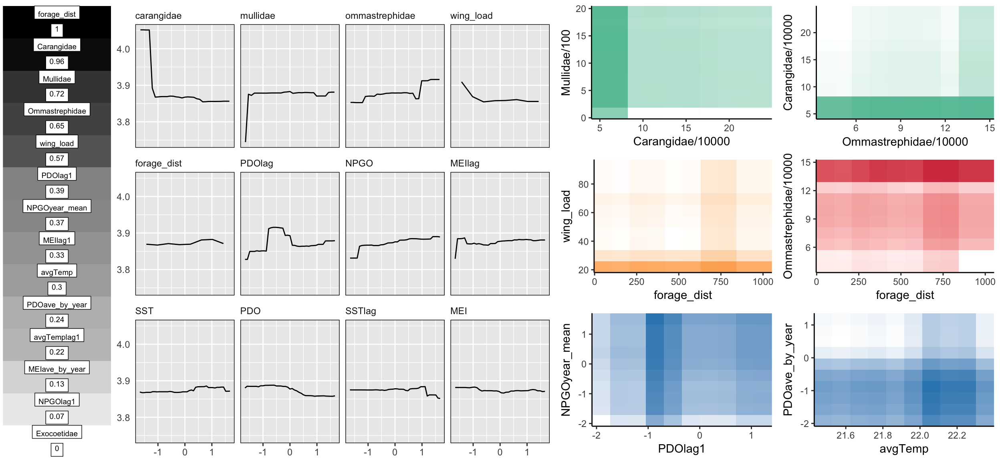

Fig5\_pub\_post
================
Tyler Gagne
6/8/2017

**Single Column Imp Plot**

generate and index variable importance single column gradient plot

``` r
importance <- as.data.frame(melt(importance(final_fit,type=1)))
###importance gradient###
importance <- importance[-c(15,16),] #remove year and spp
#scale 0 to 1 
range01 <- function(x){(x-min(x))/(max(x)-min(x))}
importance$value <- range01(importance$value)
importance$value <- round(importance$value,digits=2)
importance$X1 <- factor(importance$X1, levels = importance$X1[order(importance$value)])
scale<-ggplot(importance,aes(x = X2, y = X1, fill = value))+
  geom_tile(show.legend = FALSE) + 
  geom_label(aes(label=value),size = 2.5,fill = "white",label.r = unit(0,"lines"),nudge_x = 0,nudge_y = -.05,vjust = "top",hjust="center")+
  geom_label(aes(label=X1),size = 2.5, fill = "white",label.r = unit(0,"lines"),nudge_x = 0,nudge_y = 0.1,vjust = "bottom",hjust="center")+
  theme_classic() +
  scale_fill_gradient(low = "white",high = "black") +
  scale_x_discrete(position = "top") +
  theme(axis.title.x.top =element_blank(),
        axis.title.y = element_blank(),
        axis.text.y=element_blank(),
        axis.text.x=element_blank(),
        axis.ticks.y=element_blank(),
        axis.ticks.x=element_blank())+
  theme_void()
```

rename partial dependence dataframe columns

``` r
colnames(df1) <- c("forage_dist","trophic_position")
colnames(df2) <- c("carangidae","trophic_position")
colnames(df3) <- c("mullidae","trophic_position")
colnames(df4) <- c("MEI","trophic_position")
colnames(df5) <- c("ommastrephidae","trophic_position")
colnames(df6) <- c("wing_load","trophic_position")
colnames(df7) <- c("PDOlag","trophic_position")
colnames(df8) <- c("NPGO","trophic_position")
colnames(df9) <- c("MEIlag","trophic_position")
colnames(df10) <- c("SST","trophic_position")
colnames(df11) <- c("PDO","trophic_position")
colnames(df12) <- c("SSTlag","trophic_position")

#melt and reshape
a<-Reduce(function(x, y) merge(x, y, all=TRUE), list(df1, df2, df3,df4,df5,df6,df7,df8,df9,df10,df11,df12))
b<-as.data.frame(scale(a[,2:13]))
a<-cbind(a$trophic_position,b)
a<-melt(a,id.vars = c(1))
colnames(a) <- c("trophic_position","predictor","value")
```

**Develop faceted partial dependence plot**

``` r
a$predictor <- factor(a$predictor, levels=c("carangidae", "mullidae", "ommastrephidae", "wing_load", "forage_dist","PDOlag","NPGO","MEIlag","SST","PDO","SSTlag","MEI"))
pdep2d<-ggplot(a,aes(y=trophic_position,x=value))+geom_line()+facet_wrap(~predictor,nrow=3)+xlab(NULL)+
  theme(axis.title.y=element_blank(),axis.ticks.y=element_blank(),strip.background = element_blank(),panel.border = element_rect(colour = "black", fill=NA, size=.5),legend.title=element_blank(),
                              strip.text=element_text(hjust=0))
```

Build heatmap function that allows partial depenedence data input, specify axes, and ramp gradient color hex.

``` r
heatmap <- function(data,x,y,high.col){
  x<-substitute(x)
  y<-substitute(y)
  yhat <-data[,3]
  g<-ggplot(data,aes_string(x=x,y=y,fill=yhat))+geom_tile(show.legend = FALSE)+scale_fill_gradient(low="white", high= high.col)+
    scale_y_continuous(expand = c(0,0)) +scale_x_continuous(expand = c(0,0)) +theme(axis.ticks.y=element_blank(),text=element_text(size=12, family="Calibri"),axis.ticks.x=element_blank())+theme_classic()
    return(g)}
  
#Fish only - #66c2a5
#eco morph - #fdae61
#climate - #3288bd
#mix - #d53e4f
```

``` r
grid.arrange(
  #first column
  g1,
  #second facet block
  g2,
  
  #row1
  caran_x_mulli,
  omma_x_caran,
  #row2
  wing_x_forage,
  forage_x_omma,
  
  #row3
  PDOlag_x_NPGO,
  SST_x_PDO,

            layout_matrix = lay)
```


