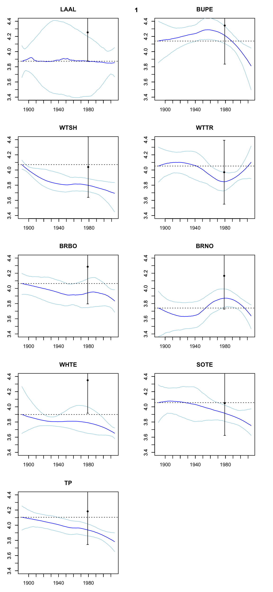

Figure1\_longitudinaltrend
================
Tyler Gagne
6/8/2017

Build function to draw random AA samples from analytic's distribution

``` r
N <- 1000

GetTP <- function(anID){
  b = 2.4167
  TEF = 5.6333
  ala.est<- rnorm(N, mean = as.numeric(subset(anID, value == "ave", select = "ala")) , sd = as.numeric(subset(anID, value == "sd", select = "ala")))
  glu.est<- rnorm(N, mean = as.numeric(subset(anID, value == "ave", select = "glue")) , sd = as.numeric(subset(anID, value == "sd", select = "glue")))
  ile.est<- rnorm(N, mean = as.numeric(subset(anID, value == "ave", select = "ile")) , sd = as.numeric(subset(anID, value == "sd", select = "ile")))
  leu.est<- rnorm(N, mean = as.numeric(subset(anID, value == "ave", select = "leu")) , sd = as.numeric(subset(anID, value == "sd", select = "leu")))
  pro.est<- rnorm(N, mean = as.numeric(subset(anID, value == "ave", select = "pro")) , sd = as.numeric(subset(anID, value == "sd", select = "pro")))
  val.est<- rnorm(N, mean = as.numeric(subset(anID, value == "ave", select = "val")) , sd = as.numeric(subset(anID, value == "sd", select = "val")))
  phe.est<- rnorm(N, mean = as.numeric(subset(anID, value == "ave", select = "phe")) , sd = as.numeric(subset(anID, value == "sd", select = "phe")))
  TPforID <- (((((ala.est + glu.est + ile.est + leu.est + pro.est + val.est)/6)) - phe.est - b)/TEF ) + 1 
  return(TPforID)}
```

Apply function to list

``` r
sppx<-c("LAAL","BUPE","WTSH","WTTR","BRBO","BRNO","WHTE","SOTE","TP")         # adjust order taxonomically 

S <- 1000

par(mfrow=c(5,2), mai = c(.4, 0.4, 0.4, 0.4))                                 # build plot frame
for(x in 1:length(sppx)){
  if(x < 9) {
    species_data <- subset(total, spp == sppx[x])
  } else{
    species_data <- total
  }
   tp_predict = as.data.frame(matrix(ncol=1000,nrow=126))
  
  for (i in 1:S){
    new_df <- ddply(species_data,.(year),function(x) x[sample(nrow(x),1),])   # sample value from each available year
    tp_est <- loess(tp ~ year, new_df,span = 1)                               # fit loess model through the series
    tp_predict[i] <- as.data.frame(predict(tp_est,data.frame(year = seq(1890, 2015,1)))) # predict for all years
  }
  tp_predict$year <- seq(1890, 2015, by = 1)
  test_data_long <- melt(tp_predict, id="year")
  
  #gather quantiles from data
  sum_data<- do.call(data.frame,aggregate(value ~ year, data = test_data_long, function(x) c(quantile(x,.975),quantile(x,.025),median(x) )))
  
  #build plots
  plot(sum_data$year,sum_data$value.V3, type = "l",col="blue",main = sppx[x], ylab = '',xlab = '',ylim=c(3.4,4.4))
  lines(sum_data$year,sum_data$value.97.5.,col="light blue")
  lines(sum_data$year,sum_data$value.2.5.,col="light blue")
  
  b<-1979
  
  #overlay Harrison et al. 1983 calculated trophic levels 
  if(x < 9) {
    z<-subset(preyMTL_data,spp = species_data$spp[x])
    y<-z$ad_mean_tl[x]
    points(b,y,pch = 20)
    sd<-z$SE_mean_TL[x]
    arrows(b,y-sd,b,y+sd, code=3, length=0.02, angle = 90)
    abline(h=subset(sum_data, year == 1891, select = value.V3 ),lty = "dotted" )
  }else{
    b<- 1979
    y<-mean(preyMTL_data$ad_mean_tl)
    points(b,y, pch = 20)
    sd<-mean(z$SE_mean_TL)
    arrows(b,y-sd,b,y+sd, code=3, length=0.02, angle = 90)
    abline(h=subset(sum_data, year == 1891, select = value.V3 ),lty = "dotted" )
  }
  
  labels_axes <- c("")
  y_ticks = c(3.4,3.5,3.6,3.7,3.8,3.9,4.0,4.1,4.2,4.3,4.4)
  x_ticks = c(1900,1910,1920,1930,1940,1950,1960,1970,1980,1990,2000,2010)
  axis(side = 1, at = x_ticks, labels = FALSE, outer = FALSE)
  axis(side = 2, at = y_ticks, labels = TRUE, outer = FALSE)
  
  title(tp_est $pars $span, outer = TRUE, cex = 1.5, line = -2)
}  
```


