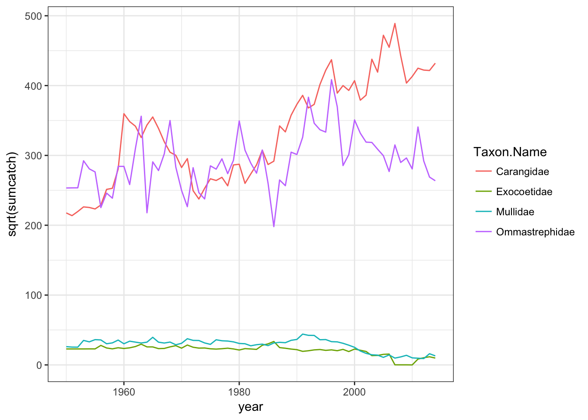
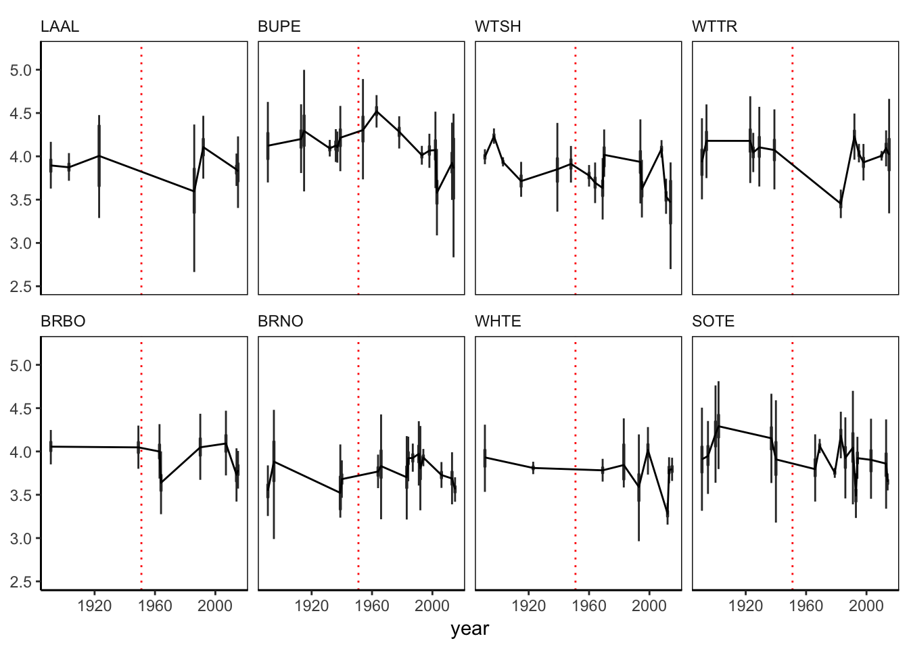
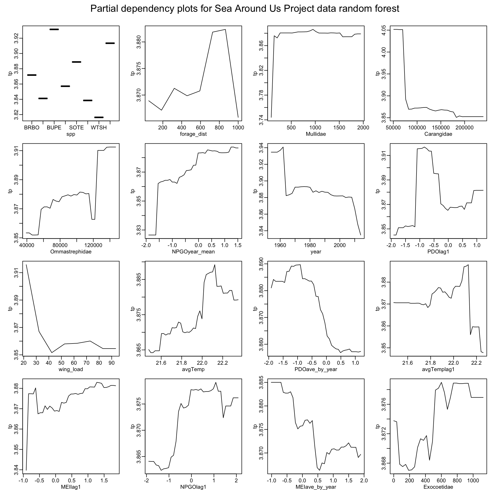
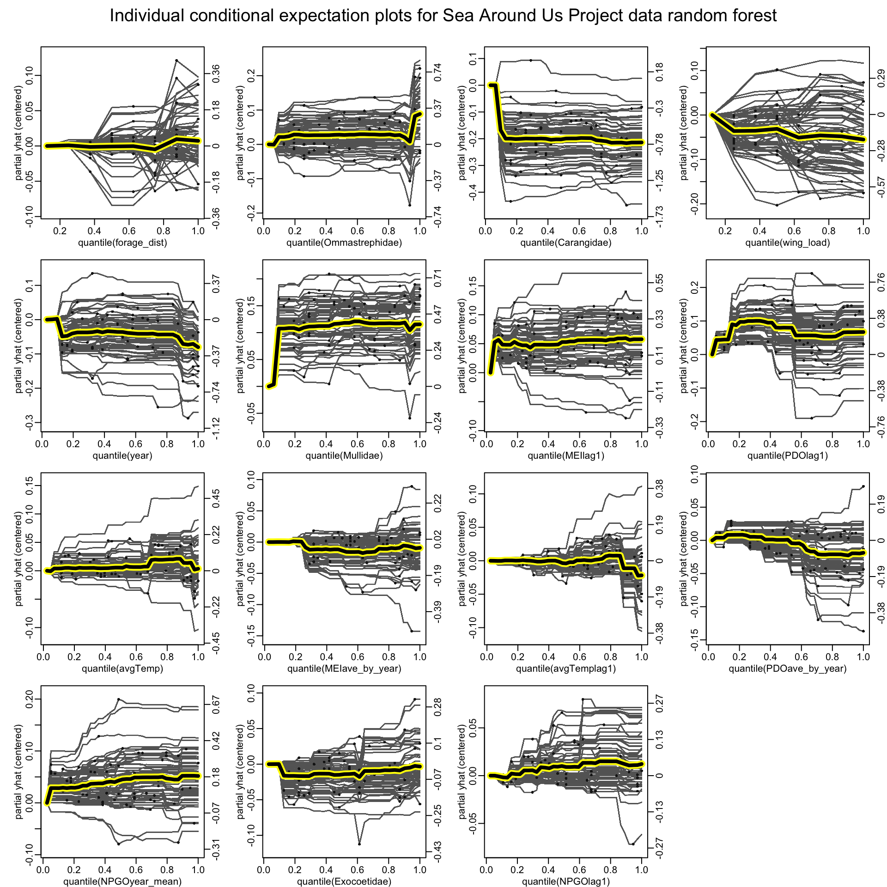

Seabird Random Forest Model - June 2017
================
Tyler Gagne
6/1/2017

*Set working directory and read in dataset*

Read in reconstuctured Sea Around Us project data

``` r
famandspp<-read.csv("SAULandings_familyandspp.csv", header = T)
```

a plot to take a look at it

``` r
a<-ggplot(famandspp,aes(x=year,y=sqrt(sumcatch)))+
  geom_line(aes(color=Taxon.Name))+theme_bw()
a
```



recast and from in to df with columns for catch taxa

``` r
df <- data.frame(cast(famandspp, year ~ Taxon.Name ))
```

    ## Using sumcatch as value column.  Use the value argument to cast to override this choice

*Bring in old dataset*

``` r
bigger_data<-read.csv("final_dataset_may10.csv", header = T)
###EDIT BUPE FORAGE DIST TO 350###
BUPE_new_forage_dist <- 350
bigger_data$forage_dist[bigger_data$spp == "BUPE"] <- BUPE_new_forage_dist
###NOTE: for lag variable incorporation, must be run post 1951 due to NPGO availability up to 1950
#subset out post 1950 data
```

*Subset out post-1950 and merge in SAU data*

``` r
full_data <- subset(bigger_data,year >= 1951)
#merge in SAU fisheries
test<-merge(full_data,df,by="year")
full_data <- test
str(full_data)
```

    ## 'data.frame':    77000 obs. of  79 variables:
    ##  $ year                     : int  1954 1954 1954 1954 1954 1954 1954 1954 1954 1954 ...
    ##  $ X.1                      : int  43864 51593 40439 36203 51978 42137 35607 31290 50541 52347 ...
    ##  $ spp                      : Factor w/ 8 levels "BRBO","BRNO",..: 3 3 3 3 3 3 3 3 3 3 ...
    ##  $ X                        : int  49845 39745 44242 44291 36979 51919 37253 44723 48544 32233 ...
    ##  $ aveENSO_SST_by_year      : num  26.5 26.5 26.5 26.5 26.5 ...
    ##  $ MEIave_by_year           : num  -0.534 -0.534 -0.534 -0.534 -0.534 ...
    ##  $ PDOave_by_year           : num  -0.328 -0.328 -0.328 -0.328 -0.328 ...
    ##  $ uc_id                    : Factor w/ 134 levels "KVH007","KVH008",..: 83 83 60 83 64 60 60 64 83 60 ...
    ##  $ accession_id             : Factor w/ 134 levels "1891_BRBO_773",..: 54 54 52 54 53 52 52 53 54 52 ...
    ##  $ value                    : Factor w/ 1 level "ave": 1 1 1 1 1 1 1 1 1 1 ...
    ##  $ ala                      : num  27.9 27.9 24.9 27.9 26.3 ...
    ##  $ asp                      : num  22 22 20.5 22 20 ...
    ##  $ glue                     : num  29.9 29.9 26.8 29.9 28.4 ...
    ##  $ gly                      : num  7.65 7.65 5.99 7.65 3.57 ...
    ##  $ ile                      : num  31.7 31.7 28.1 31.7 28.9 ...
    ##  $ leu                      : num  31.3 31.3 26.7 31.3 27.9 ...
    ##  $ phe                      : num  10.74 10.74 5.54 10.74 7.97 ...
    ##  $ pro                      : num  32.1 32.1 30.4 32.1 28.8 ...
    ##  $ val                      : num  33.2 33.2 29.9 33.2 30.7 ...
    ##  $ tp                       : num  4.06 4.03 4.58 4.02 4.27 ...
    ##  $ family                   : Factor w/ 5 levels "Diomedeidae",..: 3 3 3 3 3 3 3 3 3 3 ...
    ##  $ group                    : Factor w/ 7 levels "Albatross","Booby",..: 3 3 3 3 3 3 3 3 3 3 ...
    ##  $ common.name              : Factor w/ 8 levels "Brown Booby",..: 3 3 3 3 3 3 3 3 3 3 ...
    ##  $ species                  : Factor w/ 8 levels "Anous stolidus",..: 2 2 2 2 2 2 2 2 2 2 ...
    ##  $ guild                    : Factor w/ 4 levels "Plunge diving",..: 4 4 4 4 4 4 4 4 4 4 ...
    ##  $ mass_lo_g                : int  78 78 78 78 78 78 78 78 78 78 ...
    ##  $ mass_hi_g                : int  130 130 130 130 130 130 130 130 130 130 ...
    ##  $ length_cm                : num  27 27 27 27 27 27 27 27 27 27 ...
    ##  $ iucn_stat                : Factor w/ 2 levels "LC","NT": 1 1 1 1 1 1 1 1 1 1 ...
    ##  $ FAO_exocoetidae_catch    : int  17100 17100 17100 17100 17100 17100 17100 17100 17100 17100 ...
    ##  $ FAO_mullidae_catch       : int  5100 5100 5100 5100 5100 5100 5100 5100 5100 5100 ...
    ##  $ FAO_ommastrephidae_catch : int  440499 440499 440499 440499 440499 440499 440499 440499 440499 440499 ...
    ##  $ FAO_gempylidae_catch     : int  0 0 0 0 0 0 0 0 0 0 ...
    ##  $ FAO_sternoptychidae_catch: int  0 0 0 0 0 0 0 0 0 0 ...
    ##  $ FAO_gempylidae_catch.1   : int  0 0 0 0 0 0 0 0 0 0 ...
    ##  $ FAO_hemiramphidae_catch  : int  5900 5900 5900 5900 5900 5900 5900 5900 5900 5900 ...
    ##  $ FAO_carangidae_catch     : int  371383 371383 371383 371383 371383 371383 371383 371383 371383 371383 ...
    ##  $ FAO_syndontidae_catch    : int  28400 28400 28400 28400 28400 28400 28400 28400 28400 28400 ...
    ##  $ FAO_coryphaenidae_catch  : int  5800 5800 5800 5800 5800 5800 5800 5800 5800 5800 ...
    ##  $ NPGOyear_mean            : num  0.207 0.207 0.207 0.207 0.207 ...
    ##  $ NPGO_lowpass             : num  -0.038 -0.038 -0.038 -0.038 -0.038 ...
    ##  $ caran_pec_total          : int  9136 9136 9136 9136 9136 9136 9136 9136 9136 9136 ...
    ##  $ caran_pne_total          : int  0 0 0 0 0 0 0 0 0 0 ...
    ##  $ caran_pwc_total          : int  48400 48400 48400 48400 48400 48400 48400 48400 48400 48400 ...
    ##  $ exoco_pec_total          : int  0 0 0 0 0 0 0 0 0 0 ...
    ##  $ exoco_pnw_total          : int  11300 11300 11300 11300 11300 11300 11300 11300 11300 11300 ...
    ##  $ exoco_pwc_total          : int  5800 5800 5800 5800 5800 5800 5800 5800 5800 5800 ...
    ##  $ mull_pwc_total           : int  1700 1700 1700 1700 1700 1700 1700 1700 1700 1700 ...
    ##  $ mull_pec_total           : int  0 0 0 0 0 0 0 0 0 0 ...
    ##  $ mull_pnw_total           : int  3400 3400 3400 3400 3400 3400 3400 3400 3400 3400 ...
    ##  $ omma_pec_total           : int  3699 3699 3699 3699 3699 3699 3699 3699 3699 3699 ...
    ##  $ omma_pne_total           : int  0 0 0 0 0 0 0 0 0 0 ...
    ##  $ omma_pnw_total           : int  436800 436800 436800 436800 436800 436800 436800 436800 436800 436800 ...
    ##  $ omma_pwc_total           : int  0 0 0 0 0 0 0 0 0 0 ...
    ##  $ syno_pwc_total           : int  400 400 400 400 400 400 400 400 400 400 ...
    ##  $ syno_pnw_total           : int  28000 28000 28000 28000 28000 28000 28000 28000 28000 28000 ...
    ##  $ caran_total              : int  371383 371383 371383 371383 371383 371383 371383 371383 371383 371383 ...
    ##  $ exoco_total              : int  17100 17100 17100 17100 17100 17100 17100 17100 17100 17100 ...
    ##  $ mull_total               : int  5100 5100 5100 5100 5100 5100 5100 5100 5100 5100 ...
    ##  $ omma_total               : int  440499 440499 440499 440499 440499 440499 440499 440499 440499 440499 ...
    ##  $ syno_total               : int  28400 28400 28400 28400 28400 28400 28400 28400 28400 28400 ...
    ##  $ avgTemp                  : num  21.8 21.8 21.8 21.8 21.8 ...
    ##  $ lm                       : num  21.8 21.8 21.8 21.8 21.8 ...
    ##  $ lm_resid                 : int  -1 -1 -1 -1 -1 -1 -1 -1 -1 -1 ...
    ##  $ PDOlag1                  : num  -0.566 -0.566 -0.566 -0.566 -0.566 ...
    ##  $ NPGOlag1                 : num  1.08 1.08 1.08 1.08 1.08 ...
    ##  $ avgTemplag1              : num  21.8 21.8 21.8 21.8 21.8 ...
    ##  $ MEIlag1                  : num  0.46 0.46 0.46 0.46 0.46 ...
    ##  $ body_mass                : num  0.073 0.073 0.073 0.073 0.073 0.073 0.073 0.073 0.073 0.073 ...
    ##  $ wing_area                : num  0.033 0.033 0.033 0.033 0.033 0.033 0.033 0.033 0.033 0.033 ...
    ##  $ wing_load                : num  22 22 22 22 22 ...
    ##  $ wing_span                : num  54.9 54.9 54.9 54.9 54.9 ...
    ##  $ wing_aspect              : num  9.26 9.26 9.26 9.26 9.26 ...
    ##  $ range_limit              : num  43.8 43.8 43.8 43.8 43.8 ...
    ##  $ forage_dist              : num  350 350 350 350 350 350 350 350 350 350 ...
    ##  $ Carangidae               : num  50821 50821 50821 50821 50821 ...
    ##  $ Exocoetidae              : num  527 527 527 527 527 ...
    ##  $ Mullidae                 : num  1092 1092 1092 1092 1092 ...
    ##  $ Ommastrephidae           : num  78810 78810 78810 78810 78810 ...

``` r
###################################################
#set seed to replicate bootstrapping nature of RF##
###################################################
set.seed(123)
```

**Data post-simulation, boxplots by year of trophic position estimates drawn from feather specimens.** *Red dotted line represents 1951, the year from which all climate, climate lag, and fisheries data is complete and the time period cutoff for the data input in to the random forest model.*

``` r
plot <- bigger_data
plot$spp <- factor(plot$spp, levels=c("LAAL", "BUPE", "WTSH", "WTTR", "BRBO","BRNO","WHTE","SOTE","TP"))
ggplot(plot,aes(x=year,y=tp))+
  geom_boxplot(aes(x=year,y=tp,group=as.factor(year)),outlier.shape = NA)+
  facet_wrap(~spp,ncol = 4)+
  geom_vline(xintercept=1951,linetype="dotted",color = "red")+
  theme_classic()+
  theme(axis.title.y=element_blank(),
                       strip.background = element_blank(),
                       panel.border = element_rect(colour = "black", fill=NA, size=.5),
                       legend.position = c(0.15, 0.8),
                       legend.key.size = unit(.75, "cm"),
                       legend.title=element_blank(),
                       strip.text=element_text(hjust=0))+ylab("trophic position")+
  stat_summary(fun.y=mean, geom="line", aes(group = 1)) 
```



This the syntax input of the randomForest model input. ntree is the number of trees used to build the model. A data partition to speed up/create a testset. Then a formula expression of the model to be built

``` r
#################################
#################################
#####Full model Development######
#################################

ntree = 100
#create data partition for training set 
InTrain<-createDataPartition(full_data$spp,p=0.8,list=FALSE)
#partion out training set
training1<-full_data[InTrain,]
#partition out validation/test set
testing1<-full_data[-InTrain,]
Seabird_Random_Forest <- randomForest(tp ~ #current climate
                            MEIave_by_year +PDOave_by_year +NPGOyear_mean +avgTemp +
                            #lagged climate
                            PDOlag1 +NPGOlag1 +avgTemplag1 +MEIlag1 +
                            #prey pressure/abundance
                            Carangidae +Exocoetidae +Mullidae +Ommastrephidae +
                            #morphology
                            forage_dist + wing_load + spp + 
                            #timeline
                            year,
                          data=training1,
                          importance = TRUE,
                          ntree = ntree)
```

**Variable importance and OOB error improvement** We utilized a variable importance metric that measures reduction of mean squared error of a model when a predictor is randomly permuted (i.e. ‘noised up’), which allows for a rank order of variable influence on the model.


**Partial dependence plots** Partial dependence plots visualize the average partial relationship between the predicted response and a predictor conditioned on all other predictors.



**Partial dependence surface plots**

Selection of interactions between predictors and trophic position response. Yellow cells indicate relatively higher trophic position, relatively lower is blue. Polygons indicate the convex hull of the training values.


**Individual conditional expectation (ICE) plots**

ICE plots function as refined partial dependence plots showing the functional relationship between the predicted response and the feature for a subset of individual observations. ICE plots effectively highlight the variation in fitted values. Predictors are pinched at minimum observed value such that the right vertical axis displays change in the response over the baseline as fraction of the response’s observed range. While the left y-axis shows a conventional, centered conditional response akin to a traditional partial dependence plot (yellow highlighted black line). Plots showing wedges acorss their range are more interactive (forage dist, wingload,MEIave, avgTemplag1, etc) than those showing primarily parallel responses which tend to be addititive (year, mullidae, MEI lag1). Plots are rank ordered by variable importance as a measure of percent mean squared error reduction under permutation.

BUILDING ICE PLOTS FOR FIGURE

``` r
library(ICEbox)
```

    ## Loading required package: sfsmisc

    ## 
    ## Attaching package: 'sfsmisc'

    ## The following object is masked from 'package:dplyr':
    ## 
    ##     last

``` r
Z <- subset(training1, select = c("tp", "MEIave_by_year","PDOave_by_year","NPGOyear_mean" ,"avgTemp" ,
                                  "PDOlag1", "NPGOlag1","avgTemplag1" ,"MEIlag1" ,
                                  "Carangidae" ,"Exocoetidae" ,"Mullidae" ,"Ommastrephidae" ,
                                  "forage_dist" , "wing_load" , "spp" , 
                                  "year"))
final_fit <- randomForest(Z[,2:17],Z[,1],ntree = ntree, importance = TRUE)
sonarimp <- importance(final_fit)
impvar<- rownames(sonarimp)[order(sonarimp[,1],decreasing = TRUE)]
impvar <- impvar[2:16]
```


